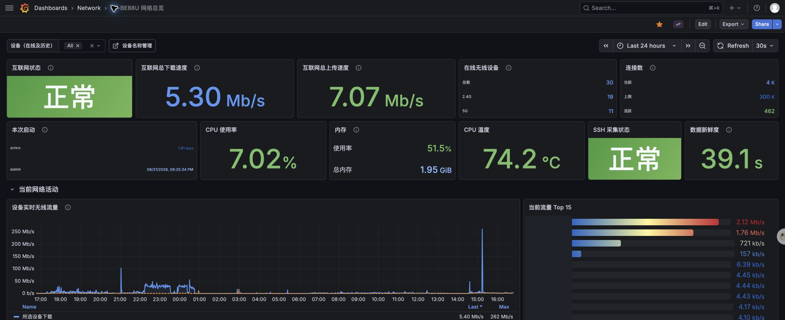
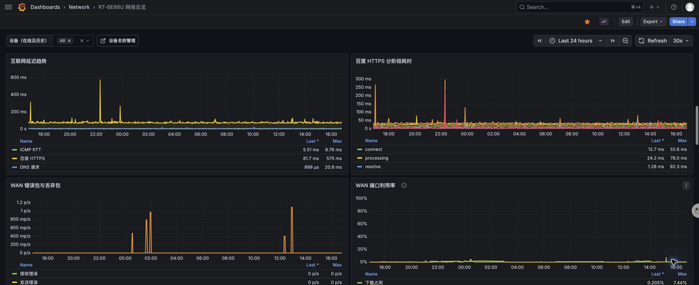
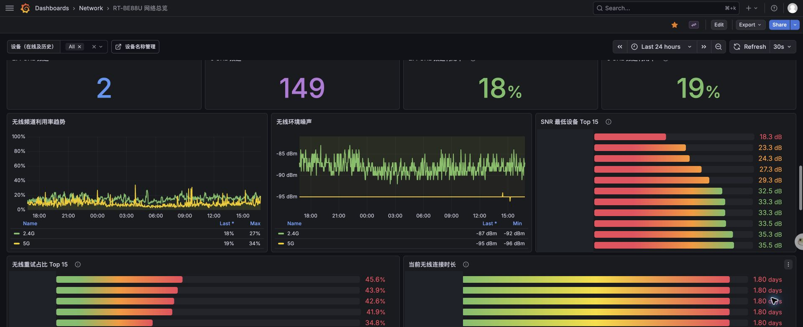
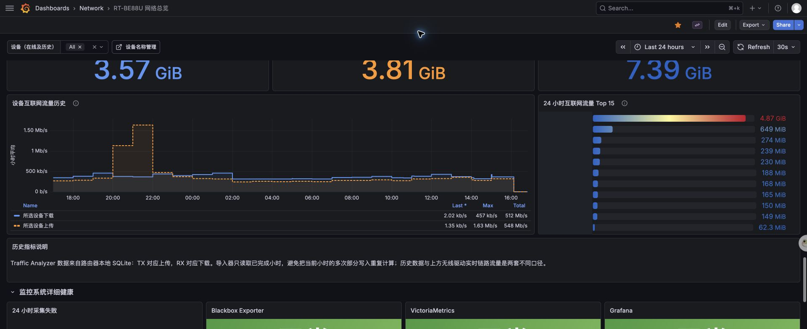

# Asuswrt-Merlin Monitoring

[English](README.md) | 简体中文

通过 SSH 和 Blackbox Exporter 监控华硕路由器，并用 VictoriaMetrics 与 Grafana 展示路由器健康、WAN 流量、无线客户端质量和历史流量。SNMP 仅作为可选扩展，默认仪表盘不依赖它。

项目最初针对 RT-BE88U + Asuswrt-Merlin 3006.102.8_4 构建。SSH 采集部分依赖 `nvram`、`wl`、`conntrack` 和 Asuswrt Traffic Analyzer，其他型号需要先运行只读前置检查和一次 `--once` 验证兼容性。

## 功能

- 路由器开机时间、固件、CPU、负载、内存、温度和 Conntrack
- 通过 SSH 采集 WAN 状态、流量、数据包、错误、丢弃、协商速度和端口利用率
- 无线客户端 MAC、IP、名称、频段、RSSI、SNR、协商速率和重试
- 基于 MAC 的设备名称覆盖网页
- Traffic Analyzer 小时级设备历史流量导入
- HTTP、ICMP、DNS 延迟和可用性探测
- Grafana 总览模板和 VictoriaMetrics 抓取配置
- systemd 开机自启动示例

## 架构

```text
ASUS Router
  ├─ SSH ───────────────> asus-wifi-exporter :9101
  └─ Traffic Analyzer ──> asus-traffic-importer

Internet targets ───────> blackbox_exporter :9115
                                 │
                                 ▼
                       VictoriaMetrics :8428
                                 │
                                 ▼
                            Grafana :3000
```

更详细的数据流见 [架构与数据流](docs/architecture.md)。

## Grafana 效果预览

截图来自实际运行环境，已遮挡设备名称、IP、MAC 和公网地址。









更多分区截图见 [Grafana 截图集](docs/screenshots.md)。

## 快速开始

1. 在路由器开启 SSH 和 Traffic Analyzer。
2. 复制环境配置并填写实际地址：

   ```bash
   sudo cp config/asus-router-monitoring.env.example /etc/default/asus-router-monitoring
   sudo editor /etc/default/asus-router-monitoring
   ```

3. 从监控服务器配置到路由器的 SSH 公钥登录，并手动接受主机指纹：

   ```bash
   sudo ssh root@192.168.1.1 -p 2222 true
   ```

4. 在安装前运行只读检查：

   ```bash
   sudo ./scripts/preflight.sh
   ```

5. 安装自定义采集器和 systemd 单元：

   ```bash
   sudo ./scripts/install-host-components.sh
   sudo systemctl enable --now asus-wifi-exporter.service
   sudo systemctl enable --now asus-traffic-importer.timer
   ```

6. 按照 [完整安装指南](docs/installation.md) 配置 Blackbox Exporter、VictoriaMetrics 和 Grafana；需要全接口 IF-MIB 时再启用可选 SNMP。

## 文档

- [完整安装指南](docs/installation.md)
- [兼容性矩阵](docs/compatibility.zh-CN.md)
- [已知限制](docs/limitations.zh-CN.md)
- [故障排除](docs/troubleshooting.zh-CN.md)
- [指标说明](docs/metrics.md)
- [安全策略](SECURITY.md)
- [贡献指南](CONTRIBUTING.md)

## 安全说明

- 不要把 SSH 私钥、真实设备别名或可选 SNMP community 提交到 Git。
- 设备名称管理接口没有鉴权，默认只监听 `127.0.0.1`。
- exporter 通过 SSH 执行只读采集命令，不执行 `nvram set`、应用设置或重启。
- Grafana 模板中的 `192.168.1.1` 和 `192.168.1.10` 都是示例值；WAN 接口会自动发现。

详见 [SECURITY.md](SECURITY.md) 和 [已知限制](docs/limitations.zh-CN.md)。

## 许可证

[MIT](LICENSE)
