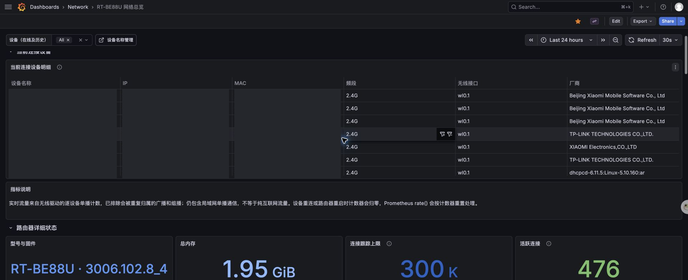
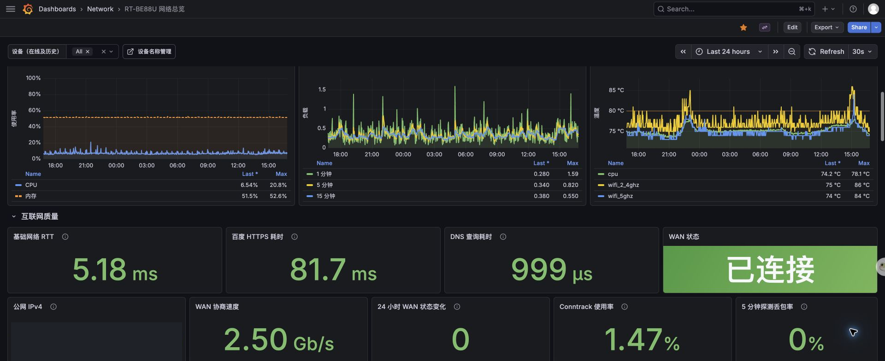
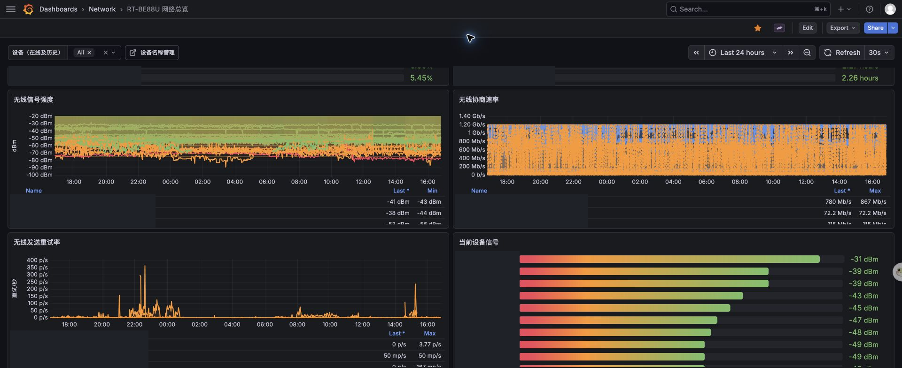
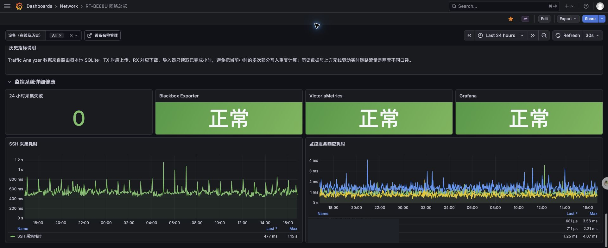

# Grafana screenshot gallery

[简体中文](screenshots.md)

These screenshots come from a working installation. Device names, client IP addresses, MAC addresses, the public address, and internal monitoring endpoints are covered with opaque redaction blocks. Raw screenshots are not included.

## Network overview

## Connected clients

## Router health and Internet summary

## Internet quality

## Wireless environment

## Wireless client quality

## Historical traffic

## Monitoring stack health

